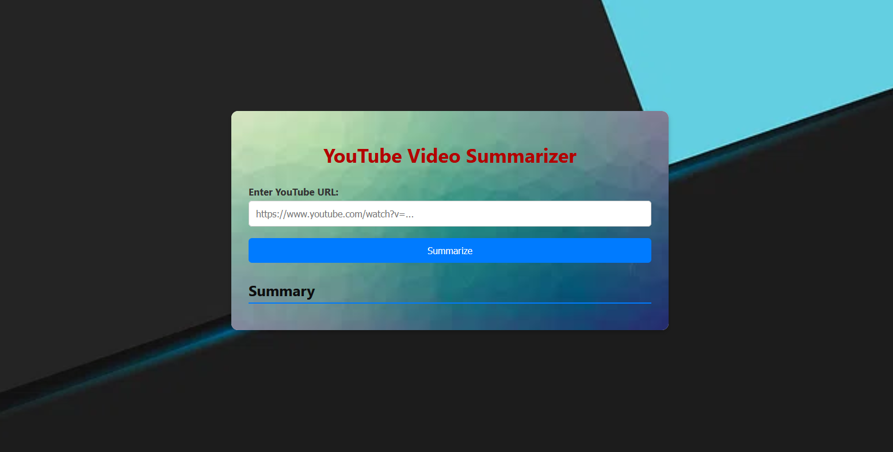

# YouTube Video Summarizer

This project provides a web interface to summarize YouTube videos. It downloads the audio from a given YouTube URL, transcribes it using Google Speech Recognition, and then generates a concise summary using the Phi-2 language model.

## Table of Contents

1. [Prerequisites](#prerequisites)
2. [Project Setup](#project-setup)
   - [Cloning the Repository](#cloning-the-repository)
   - [Setting up a Python Virtual Environment](#setting-up-a-python-virtual-environment)
   - [Installing Python Dependencies](#installing-python-dependencies)
3. [Running the Application](#running-the-application)
4. [Troubleshooting](#troubleshooting)
5. [Project Structure](#project-structure)
6. [Dependencies](#dependencies)
7. [Advanced Usage](#advanced-usage)
   - [Using a Different Summarization Model](#using-a-different-summarization-model)
   - [Using a GPU](#using-a-gpu)
   - [Deployment](#deployment)
8. [License](#license)

## 1. Prerequisites

Before you begin, you'll need the following:

- **Python:** Version 3.3 or higher. Download from [https://www.python.org/downloads/](https://www.python.org/downloads/).
- **pip:** Python's package installer (usually comes with Python).
- **FFmpeg:** Required for audio processing.
  - **Windows:** Download from [https://www.ffmpeg.org/download.html](https://www.ffmpeg.org/download.html). Ensure `ffmpeg.exe` is in your system's PATH. You can select the "Add FFmpeg to PATH" option during installation or add it manually. Alternatively, specify the full path to `ffmpeg.exe` in `main.py`'s `download_audio` function using `'ffmpeg_location'`.
  - **macOS:** Install via Homebrew: `brew install ffmpeg`
  - **Linux:** Use your distribution's package manager (e.g., `apt install ffmpeg` on Debian/Ubuntu).
- **Git:** (Optional but recommended). For cloning the project repository. Download from [https://git-scm.com/](https://git-scm.com/).

## 2. Project Setup

### Cloning the Repository

If using Git, clone the repository:

```bash
git clone https://github.com/ndeekshith/Youtube_video_Summarize
cd Youtube_video_Summarizer
```

If not using Git, download the project as a ZIP file and extract it. Then navigate into the extracted directory.

### Setting up a Python Virtual Environment (Recommended)

Create a virtual environment to isolate project dependencies:

```bash
python3 -m venv .venv
```

Activate the environment:

**Windows:**

```bash
.venv\Scripts\activate
```

**macOS and Linux:**

```bash
source .venv/bin/activate
```

You'll see `.venv` at the start of your command prompt, indicating the environment is active.

### Installing Python Dependencies

Install the required packages:

```bash
pip install -r requirements.txt
```

## 3. Running the Application

From the project's root directory (where `api.py` and `main.py` are), run:

```bash
python api.py
```

This starts the Flask development server (usually on [http://localhost:5000](http://localhost:5000)). The first run will download and cache the Phi-2 model; this might take some time. Subsequent runs will be faster. Open your browser and go to [http://localhost:5000](http://localhost:5000) to access the application.

## 4. Troubleshooting

- **ModuleNotFoundError:** Ensure you've activated the virtual environment and installed dependencies (`pip install -r requirements.txt`).
- **FFmpeg errors:** Verify FFmpeg is installed and accessible (see "Prerequisites").
- **Summarization errors/no output:** Check the console output from `api.py`. Look for errors related to transformers, network issues, or your code.
- **Slow performance:** Phi-2 is a large model. Consider a smaller model for better performance (see "Advanced Usage").
- **404 errors for ************`favicon.ico`************:** This error is harmless and will be resolved if you create and place `favicon.ico` in the `static/` folder.

## 5. Project Structure

```
Youtube_video_Summarizer/
├── static/          <- CSS, JavaScript, images
│   ├── style.css
│   ├── background.jpg
│   └── box-background.jpg
├── templates/       <- HTML templates
│   └── index.html
├── api.py          <- Flask backend
├── main.py         <- Core logic
└── requirements.txt <- Python dependencies
|___model.py <- For loading the model
```

## 6. Dependencies

- `flask` - Web framework.
- `flask-cors` - For Cross-Origin Resource Sharing (CORS).
- `speechrecognition` - Speech-to-text conversion.
- `yt-dlp` - YouTube audio download.
- `pydub` - Audio manipulation.
- `transformers` - Phi-2 model and pipeline.
- `torch` - Deep learning framework.

## 7. Advanced Usage

### Using a Different Summarization Model

Modify the `load_summarizer` function in `main.py`:

1. **Choose a model:** Explore the [Hugging Face Model Hub](https://huggingface.co/models) for alternatives.
2. **Change ************`model_name`************:** Update the pipeline function's `model_name` (or in `AutoModelForCausalLM.from_pretrained`) in `load_summarizer`.
3. **Adjust parameters:** Fine-tune `max_length`, `min_length`, `temperature`, etc., in `summarize_text` as needed.

### Using a GPU

If you have a compatible NVIDIA GPU, CUDA drivers, and the correct PyTorch version, `transformers` should automatically use the GPU. Verify with:

```python
import torch
torch.cuda.is_available()
```

If it returns `True`, GPU acceleration is available. To force CPU usage, modify `load_summarizer` to specify `device="cpu"`.


## 8. License

This project is licensed under the MIT License. See the `LICENSE` file for details.

